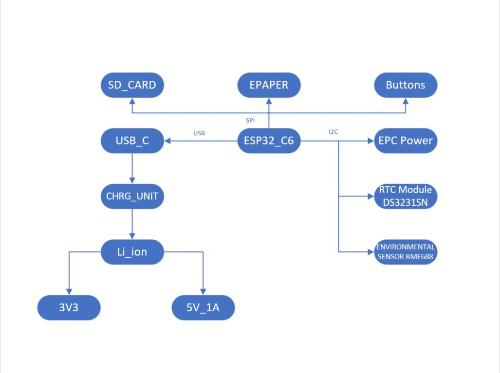
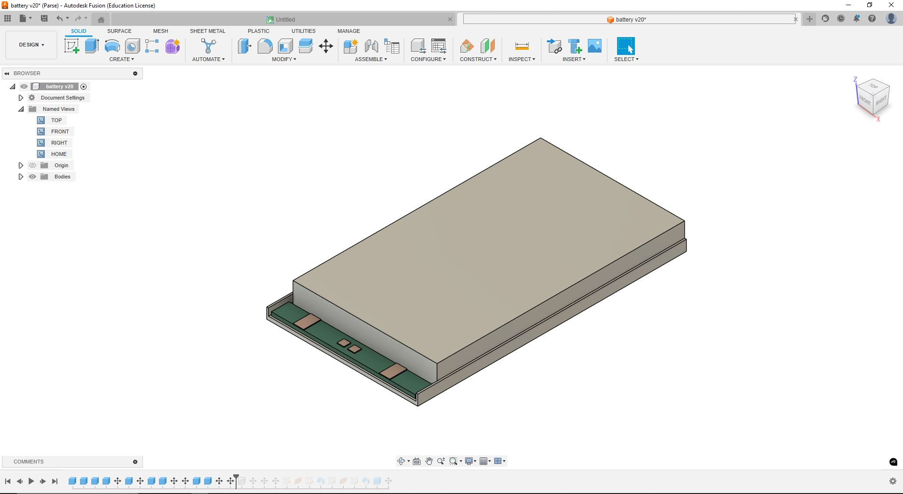
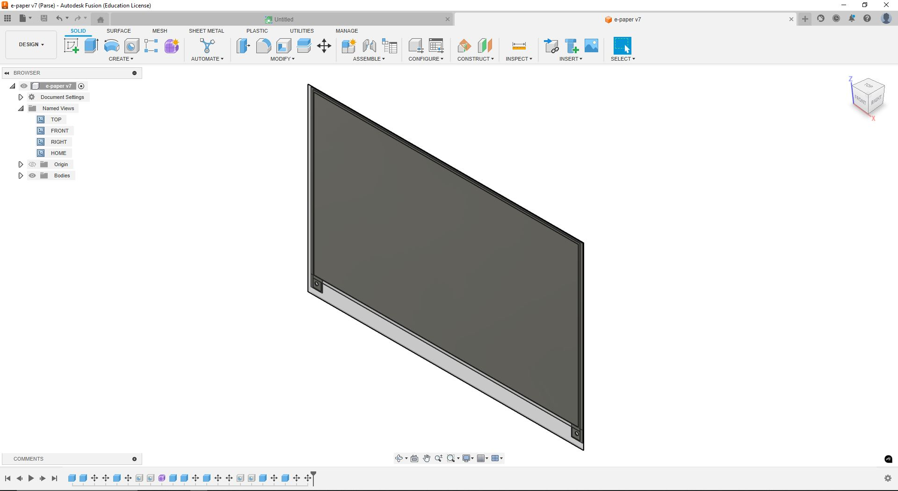

## MAHMOUDI Mohammadmehdi 322CB

# Description
EbookReader is an open-source hardware development platform featuring an E-Paper display, environmental sensing, and low-power connectivity options. Perfect for IoT projects, information displays, and environmental monitoring applications.

## 📋 Overview
This project provides a complete hardware platform built around the ESP32-C6 microcontroller with built-in WiFi 6 and Bluetooth 5 LE connectivity. The E-Paper display offers excellent visibility in various lighting conditions with minimal power consumption.

## 🔌 Hardware Architecture and Components

- **Microcontroller**: ESP32-C6-WROOM-1-N8
  - RISC-V core with WiFi 6 and Bluetooth 5 LE
  - Operating at 3.3V

- **Display**: E-Paper display module
  - SPI interface
  - Ultra-low power consumption when not refreshing

- **Storage**: 
  - microSD card slot (SPI)
  - 64MB External NOR Flash (W25Q512JVEIQ)

- **Sensors**:
  - BME688 Environmental sensor (temperature, humidity, pressure, gas)
  - Battery voltage monitoring

- **Power Management**:
  - Li-Po battery charging circuit
  - Fuel gauge (MAX17048G+T10)
  - Low dropout regulator (XC6220A331MR-G)
  - Deep sleep current <10μA

- **Timekeeping**:
  - DS3231SN RTC with temperature compensation

### Expansion Options
- Qwiic/Stemma QT connector for I²C peripherals
- Test pads for debugging

## 🔧 Development Guide

### Getting Started
1. Install the ESP-IDF development framework
2. Clone this repository
3. Connect the board via USB-C
4. Build and flash using ESP-IDF commands

### Example Applications
- Weather station
- Calendar display
- E-ink dashboard
- IoT sensor node
- Low-power data logger

## 📐 Hardware Design Files
The hardware design includes:
- Schematic
- PCB layout
- Bill of Materials
- 3D models of critical components

### Design Notes
- ESD protection on all external interfaces
- Carefully designed power distribution
- Signal integrity considerations for SPI bus
- Separate power domain for E-Paper

## 🔋 Battery Management
- Built-in Li-ion battery charging
- Battery level monitoring
- Low-battery detection and safe shutdown
- Optimized power design for long battery life

## 🛠️ Implementation Steps
1. Review schematic and understand all interfaces
2. Generate PCB layout from schematic
3. Implement power planes and critical routing
4. Add custom design rules for manufacturing
5. Place and route all signals
6. Add 3D models for visualization and mechanical fit

## ✅ Safety Features
- Overcurrent protection
- Reverse polarity protection
- ESD protection on external interfaces
- Thermal management for charging circuit

You can view the "BOM" file [here](Manufacturing/BOM.csv)
You can view the "PICK and PLACE" file [here](Manufacturing/Pick_&_Place.csv)

## 📖 Resources
- [Design & Implementation Guide](https://ocw.cs.pub.ro/courses/tsc/proiect2025)
- [ESP32-C6 Datasheet](https://www.espressif.com/sites/default/files/documentation/esp32-c6_datasheet_en.pdf)
